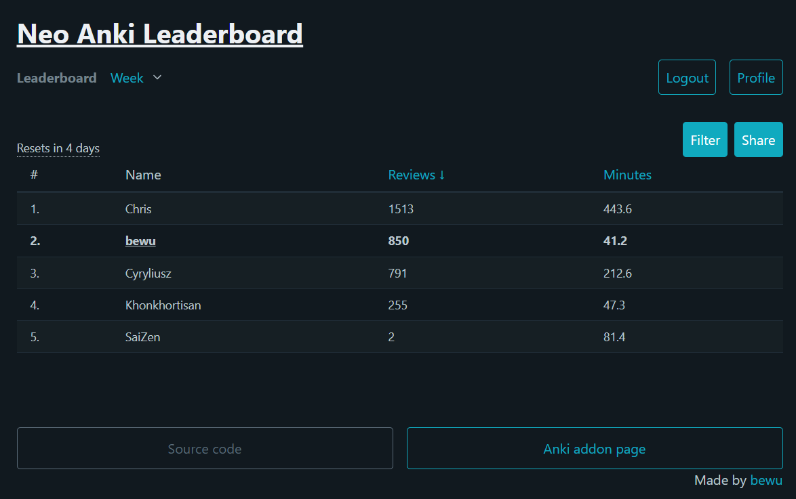
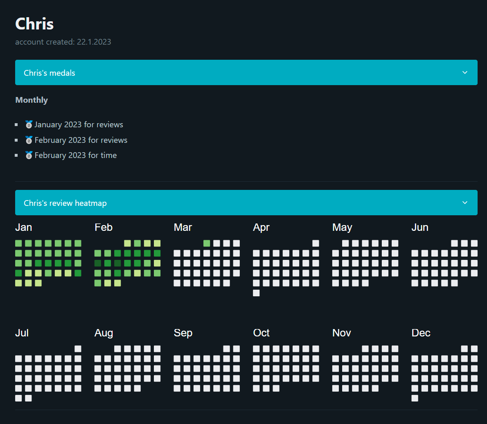

# Neo Anki LeaderBoard

This addon allows you to compete with other Anki users in a leaderboard.

You can see the leaderboard here: [neoankilb.vercel.app](https://neoankilb.vercel.app)

## Website

### Leaderboard page

### Profile page

## Installation

Go to [AnkiWeb](https://ankiweb.net/shared/info/1894428367) and follow the instructions there to install the addon.

## Usage

1. Go to the leaderboard page [neoankilb.vercel.app](https://neoankilb.vercel.app/register) and register your account.
2. Verify your email address.
3. Login in the Anki app.
4. Now, every time you sync Anki to AnkiWeb, the leaderboard will sync as well.

## Contributing

Pull requests are welcome. For major changes, please open an issue first to discuss what you would like to change.

## Website source code

The repository with source code for the website is [here](https://github.com/bewuwy/Neo-Anki-Leaderboard-Web).
